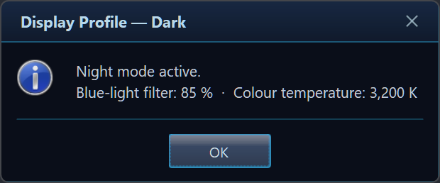
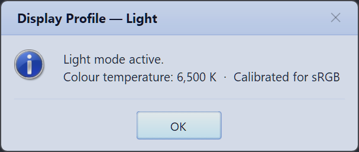
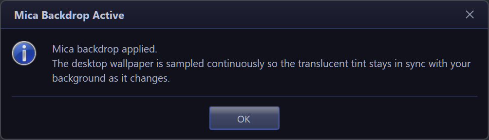
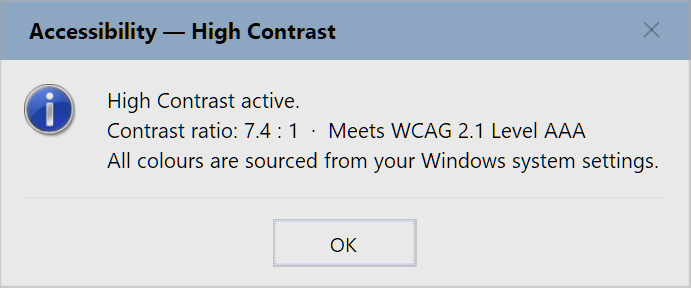
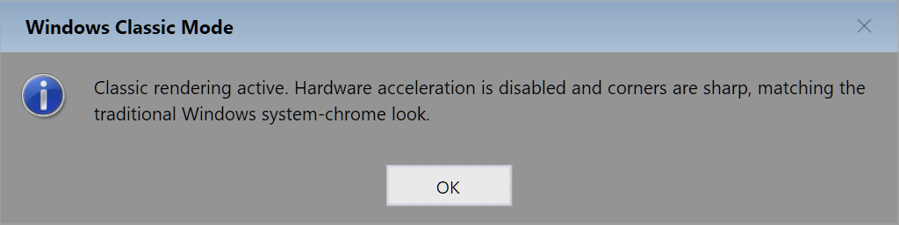

<div align="center">

# 🪟 Glass.Message

### The modern `MessageBox` replacement for Windows desktop apps

Mica &amp; Acrylic backdrops · automatic dark/light theming · fluent builder · async dialogs · inline inputs · progress · toasts · full RTL

<br/>

[](https://www.nuget.org/packages/Glass.Message)
[](https://github.com/gcfernando/glass/releases)


<br/>

<a href="https://github.com/gcfernando/glass/releases/latest"><b>⬇️ Download the latest release</b></a> · <a href="CHANGELOG.md"><b>📜 Changelog</b></a>

<br/>


<em>One tiny library. Every dialog your app will ever need.</em>

</div>

---

## ✨ The one-line pitch

You already write `MessageBox.Show(...)`. Change the type name to `GlassMessage` and your dull system dialog becomes a modern, themed, DPI-aware, animated one — **with zero other code changes.**

<table>
<tr>
<th>😴 Before — <code>MessageBox</code></th>
<th>🪟 After — <code>GlassMessage</code></th>
</tr>
<tr>
<td>

<pre lang="csharp">
MessageBox.Show(
    "The printer is offline.",
    "Printer Offline",
    MessageBoxButtons.OK,
    MessageBoxIcon.Warning);
</pre>

</td>
<td>

<pre lang="csharp">
GlassMessage.Show(
    "The printer is offline.",
    "Printer Offline",
    MessageBoxIcon.Warning);
</pre>

</td>
</tr>
<tr>
<td align="center"><em>Flat, dated, fixed grey chrome</em></td>
<td align="center"></td>
</tr>
</table>

> The `Show(...)` overloads are **signature-compatible** with `System.Windows.Forms.MessageBox`, so most call sites compile untouched and still return a `DialogResult`.

---

## 📊 Why Glass.Message?

| | `MessageBox` | **Glass.Message** |
|---|:---:|:---:|
| Drop-in `Show(...)` API | ✅ | ✅ |
| Dark / Light / custom themes | ❌ | ✅ |
| Auto-follow OS theme | ❌ | ✅ |
| Windows 11 rounded corners + Mica | ❌ | ✅ |
| Open / close animations | ❌ | ✅ |
| Inline text / password / dropdown input | ❌ | ✅ |
| Checkbox ("don't show again") | ❌ | ✅ |
| Progress bar (in the dialog) | ❌ | ✅ |
| Live progress updates (controller) | ❌ | ✅ |
| Expandable "Show details" panel | ❌ | ✅ |
| Countdown auto-close | ❌ | ✅ |
| Custom bitmap icon | ❌ | ✅ |
| `async` / awaitable + cancellable (incl. rich dialogs) | ❌ | ✅ |
| Toast notifications (multi-monitor aware) | ❌ | ✅ |
| Full RTL layout | ⚠️ partial | ✅ |
| `Ctrl+C` copies message | ✅ | ✅ |

---

## 🆕 What's new in v1.0.3

| Area | Change |
|---|---|
| **Docs** | Removed an unsubstantiated adoption claim from the NuGet README |
| **Packaging** | More reliable NuGet version badge and refreshed README badges |
| **CI** | Release workflow actions bumped to Node 24 (checkout v6, upload v7, download v8, setup-dotnet v5) |

A maintenance release — no library code or API changes. See the full [CHANGELOG](CHANGELOG.md) for details, including the prior **v1.0.2** feature and fix highlights.

---

## 🖼️ Preview Gallery

<table>
<tr>
<td align="center" width="50%"><b>Fluent builder + custom buttons</b><br/></td>
<td align="center" width="50%"><b>Inline text input</b><br/></td>
</tr>
<tr>
<td align="center"><b>Password + reveal eye + Caps Lock hint</b><br/></td>
<td align="center"><b>Drop-down picker</b><br/></td>
</tr>
<tr>
<td align="center"><b>Expandable detail (stack traces)</b><br/></td>
<td align="center"><b>Determinate progress</b><br/></td>
</tr>
<tr>
<td align="center"><b>Countdown auto-close</b><br/></td>
<td align="center"><b>"Don't show again" checkbox</b><br/></td>
</tr>
<tr>
<td align="center"><b>Async builder — awaitable rich dialogs</b><br/></td>
<td align="center"><b>Live progress controller</b><br/></td>
</tr>
</table>

<div align="center">

**Toasts** — non-modal, auto-stacking notifications at any corner


</div>

---

## 🎨 Five themes out of the box

<table>
<tr>
<td align="center"><b>Dark</b><br/></td>
<td align="center"><b>Light</b><br/></td>
<td align="center"><b>Mica</b><br/></td>
</tr>
<tr>
<td align="center"><b>High Contrast</b><br/></td>
<td align="center"><b>Windows Classic</b><br/></td>
<td align="center"><b>…or build your own</b><br/><a href="#-styling-and-customization">Custom GlassTheme →</a></td>
</tr>
</table>

```csharp
GlassMessage.Create("Mica backdrop applied.")
    .Title("Mica Backdrop Active")
    .Icon(MessageBoxIcon.Information)
    .Theme(GlassTheme.Mica)   // GlassTheme.Dark (= Default) · Light · Mica · HighContrast · WindowsClassic
    .Show();
```

---

## 📑 Table of Contents

[Features](#-features) ·
[Installation](#-installation) ·
[Quick Start](#-quick-start) ·
[Usage Guide](#-complete-usage-guide) ·
[Demo Walkthrough](#-demo-walkthrough) ·
[API](#-api-overview) ·
[Configuration](#-configuration) ·
[Styling](#-styling-and-customization) ·
[Best Practices](#-error-handling--best-practices) ·
[Structure](#-project-structure) ·
[Requirements](#-requirements) ·
[Run the Demo](#-running-the-demo) ·
[FAQ](#-faq) ·
[Full Example](#-full-example)

---

## 🚀 Features

Everything below is backed by real code in `Glass.Message` and shown live in `Glass.Demo`.

| Category | Capability |
|---|---|
| **Drop-in API** | `GlassMessage.Show(...)` overloads that mirror `MessageBox.Show` exactly |
| **Fluent builder** | `GlassMessage.Create(...)` for composable dialogs |
| **Async** | `ShowAsync(...)` on the facade **and** the builder (`ShowAsync()` / `ShowExAsync()`) — non-blocking, awaitable, cancellable |
| **Rich result** | `ShowEx()` / `ShowExAsync()` return button **+** checkbox state **+** typed input |
| **Live progress** | `ShowProgress()` → a thread-safe `GlassProgressController` you update while work runs |
| **Theming** | `Dark`, `Light`, `Mica`, `HighContrast`, `WindowsClassic` + custom themes |
| **Auto theme** | `GlassTheme.AutoDetect()` follows the Windows light/dark/HC setting |
| **Modern chrome** | Windows 11 rounded corners (DWM), Mica backdrop, Acrylic fallback |
| **Inputs** | Single-line, password (reveal + configurable Caps Lock hint), multi-line, drop-down |
| **Checkbox** | "Don't show again"-style opt-in under the message |
| **Detail panel** | Expandable "Show details" for stack traces / diagnostics |
| **Progress** | Determinate and indeterminate (marquee) bars |
| **Countdown** | Auto-confirm the default button with a live circular countdown |
| **Custom icon** | Any 48×48 `Bitmap` (e.g. a product logo) |
| **System sounds** | `Sound()` / `GlassMessage.PlaySystemSounds` play the icon's Windows sound on open |
| **Animations** | `Fade` (default), `SlideDown`, `Scale`, `None` |
| **Keyboard** | `Ctrl+C` copies title + message; `Enter`/`Esc` map to sensible results |
| **RTL** | Full right-to-left mirrored layout |
| **Toasts** | Six anchor positions, auto-stacking, multi-monitor aware, click actions, async variant |
| **Cross-target** | .NET Framework 4.8.1 and .NET 8 / 9 / 10 (Windows) |

---

## 📦 Installation

<details open>
<summary><b>Option A — Download from Releases</b> (no account, no NuGet needed)</summary>

<br/>

Grab the latest build straight from the repo's **[Releases page](../../releases)** → **Latest**. Each release includes:

| Download | Use it for |
|---|---|
| `Glass.Message.<ver>.nupkg` | The NuGet package — **all four frameworks in one file** (AnyCPU: x86 + x64) |
| `Glass.Message-<ver>-net481.zip` | Just the **.NET Framework 4.8.1** DLL + XML docs (AnyCPU) |
| `Glass.Message-<ver>-net8.0-windows.zip` | Just the **.NET 8** DLL (AnyCPU) |
| `Glass.Message-<ver>-net9.0-windows.zip` | Just the **.NET 9** DLL (AnyCPU) |
| `Glass.Message-<ver>-net10.0-windows.zip` | Just the **.NET 10** DLL (AnyCPU) |
| `Glass.Demo-<ver>-win-x64.zip` | The **runnable demo gallery, 64-bit** — unzip and run `Glass.Demo.exe` (no .NET install required) |
| `Glass.Demo-<ver>-win-x86.zip` | The **runnable demo gallery, 32-bit** — for older / x86 Windows |

To use a raw DLL, unzip it and reference `Glass.Message.dll` from your project:

```xml
<ItemGroup>
  <Reference Include="Glass.Message">
    <HintPath>libs\Glass.Message.dll</HintPath>
  </Reference>
</ItemGroup>
```

</details>

<details>
<summary><b>Option B — Project reference</b> (how the demo is wired today)</summary>

<br/>

```xml
<ItemGroup>
  <ProjectReference Include="..\Glass.Message\Glass.Message.csproj" />
</ItemGroup>
```

```bash
dotnet add reference ..\Glass.Message\Glass.Message.csproj
```

</details>

<details>
<summary><b>Option C — NuGet package (local or private feed)</b></summary>

<br/>

The downloadable `.nupkg` carries full NuGet metadata (`PackageId = Glass.Message`, MIT-licensed). Drop it into a local folder feed, then:

```bash
dotnet add package Glass.Message
```

```powershell
Install-Package Glass.Message   # Package Manager Console
```

</details>

> Then add a single `using Glass;` and you're ready. See the [CHANGELOG](CHANGELOG.md) for what's new in each version.

---

## ⚡ Quick Start

```csharp
using Glass;
using System.Windows.Forms;

// 1) (Optional) set global defaults once at startup, e.g. in Program.Main():
GlassMessage.UseRoundedCorners = true;                    // Windows 11 rounded corners
GlassMessage.DefaultTheme      = GlassTheme.AutoDetect(); // follow the OS theme

// 2) Show a basic, MessageBox-style dialog:
DialogResult result = GlassMessage.Show(
    "Your changes have been saved.",
    "Success",
    MessageBoxIcon.Information);

// 3) React to the result exactly like a classic MessageBox:
if (result == DialogResult.OK) { /* ... */ }
```

**Expected behaviour:** a themed dialog fades in, centred on the screen containing the mouse cursor (multi-monitor aware), with a glossy OK button. **Enter**, **OK**, or **Esc** all return `DialogResult.OK` for a single-button dialog.

---

## 📚 Complete Usage Guide

Grouped and collapsible — expand what you need.

<details open>
<summary><b>1 · Drop-in replacement — <code>Show</code></b></summary>

<br/>

All the classic `MessageBox` overloads exist.

```csharp
GlassMessage.Show(
    "The selected printer 'HP LaserJet Pro M404dn' is offline.\n" +
    "Check that it is powered on and connected to the network, then try again.",
    "Printer Offline",
    MessageBoxIcon.Warning);
```

**Params:** `message`, `title`, `icon`, `buttons`, `defaultButton`, optional `owner`/`theme`.
**Best practice:** keep using the returned `DialogResult` exactly as before.

</details>

<details>
<summary><b>2 · Fluent builder — <code>Create(...)</code></b></summary>

<br/>


Every method returns the builder, so calls chain.

```csharp
GlassMessage.Create(
        "Annual_Report_Q4_2025.xlsx has unsaved changes.\n\n" +
        "Closing now will discard every edit made since the last save.")
    .Title("Unsaved Changes")
    .Icon(MessageBoxIcon.Warning)
    .Buttons("Save", "Don't Save", "Cancel")
    .Default(MessageBoxDefaultButton.Button1)
    .Show();
```

**Custom button mapping** — the *number of labels* picks the nearest standard layout, so each click still maps to a meaningful `DialogResult`:

| Labels | Layout | Returned results (in order) |
|---|---|---|
| 1 | OK | `OK` |
| 2 | OK / Cancel | `OK`, `Cancel` |
| 3+ | Yes / No / Cancel | `Yes`, `No`, `Cancel` |

> ⚠️ With **three** labels, the first button returns `DialogResult.Yes` (not `OK`). Always confirm which result your labels map to.

</details>

<details>
<summary><b>3 · Auto-detect the OS theme</b></summary>

<br/>


```csharp
var theme    = GlassTheme.AutoDetect();
var modeName = GlassTheme.IsSystemDark() ? "Dark" : "Light";

GlassMessage.Create($"Windows is currently in {modeName} mode…")
    .Title("System Theme Detected")
    .Icon(MessageBoxIcon.Information)
    .Theme(theme)
    .Show();
```

**Helpers:** `GlassTheme.AutoDetect()` (returns a preset) · `GlassTheme.IsSystemDark()` (`bool`).
**Best practice:** set `GlassMessage.DefaultTheme = GlassTheme.AutoDetect();` once at startup.

</details>

<details>
<summary><b>4 · Countdown auto-close — <code>AutoClose(...)</code></b></summary>

<br/>


Auto-confirms the **default** button after a delay, with a live circular countdown and a `(Ns)` suffix.

```csharp
GlassMessage.Create("Your Contoso Portal session is about to expire.")
    .Title("Session Expiring — Contoso Portal")
    .Icon(MessageBoxIcon.Warning)
    .Buttons("Stay Signed In", "Sign Out Now")
    .AutoClose(10_000)                 // 10 seconds
    .Animation(GlassAnimation.SlideDown)
    .Show();
```

**Params:** `AutoClose(milliseconds)` (clamped ≥ 0); target = the `Default(...)` button.

</details>

<details>
<summary><b>5 · Checkbox — <code>CheckBox(...)</code> + <code>ShowEx()</code></b></summary>

<br/>


```csharp
var r = GlassMessage.Create("Drive C: has only 4.2 GB of free space remaining.")
    .Title("Low Disk Space — C:\\")
    .Icon(MessageBoxIcon.Warning)
    .Buttons("Open Disk Cleanup", "Dismiss")
    .CheckBox("Don't warn me again for drive C:\\")
    .ShowEx();

if (r.CheckBoxChecked) { /* persist the preference */ }
```

**Params:** `CheckBox(label, defaultChecked = false)`. Use `ShowEx()` to read `GlassResult.CheckBoxChecked`.

</details>

<details>
<summary><b>6 · Inputs — text · password · dropdown · multiline</b></summary>

<br/>

<table>
<tr>
<td align="center"><b>Text</b><br/></td>
<td align="center"><b>Password (Caps Lock hint on)</b><br/></td>
</tr>
<tr>
<td align="center"><b>Password (Caps Lock hint off)</b><br/></td>
<td align="center"><b>Drop-down</b><br/></td>
</tr>
</table>

```csharp
// Single-line text
var r = GlassMessage.Create("Enter a new name for the selected folder.")
    .Title("Rename Folder")
    .Icon(MessageBoxIcon.Question)
    .InputText("Folder name", "Client Projects — Q1 2026")
    .Buttons("Rename", "Cancel")
    .ShowEx();
if (r.Button == DialogResult.OK && !string.IsNullOrWhiteSpace(r.InputText)) { /* r.InputText */ }

// Masked password — reveal eye + Caps Lock badge are shown by default
GlassMessage.Create("Authentication is required to connect to Contoso ERP.")
    .Title("Sign In — Contoso ERP")
    .InputPassword("Active Directory password")
    .Buttons("Connect", "Cancel")
    .ShowEx();

// Suppress the Caps Lock badge (e.g. kiosk / PIN entry where it's not helpful)
GlassMessage.Create("Enter your PIN to unlock the device.")
    .Title("Device Locked")
    .InputPassword("PIN", showCapsLockHint: false)
    .Buttons("Unlock", "Cancel")
    .ShowEx();

// Drop-down picker
GlassMessage.Create("Choose the output format.")
    .Title("Export Document")
    .InputDropdown(
        ["PDF — Portable Document Format",
         "Word (.docx) — Microsoft Word",
         "Excel (.xlsx) — Microsoft Excel"],
        "PDF — Portable Document Format")   // pre-selected
    .Buttons("Export", "Cancel")
    .ShowEx();
```

**Methods:** `InputText(placeholder, defaultValue)` · `InputPassword(placeholder, showCapsLockHint = true)` · `InputMultiline(placeholder, defaultValue)` · `InputDropdown(items, defaultItem)`.
**Read back:** `GlassResult.InputText` (never `null`).
**Best practice:** treat password `InputText` as a secret — don't log it. Set `showCapsLockHint: false` to hide the Caps Lock badge (e.g. for PIN or kiosk flows).

</details>

<details>
<summary><b>7 · Expandable detail — <code>Detail(...)</code></b></summary>

<br/>


Hides verbose diagnostics behind a **"Show details ▼"** link.

```csharp
GlassMessage.Create("OneDrive failed to sync 'Annual_Report_Q4_2025.xlsx'.")
    .Title("Sync Error — OneDrive")
    .Icon(MessageBoxIcon.Error)
    .Detail(
        "System.IO.IOException: The process cannot access the file ...\n" +
        "Win32 error:     0x80070020 — ERROR_SHARING_VIOLATION\n" +
        "Correlation ID:  a3f8b2e1-4d9c-47f2-8b1a-c6e5d0f92341")
    .Buttons(MessageBoxButtons.RetryCancel)
    .Show();
```

**Best practice:** user-facing guidance in the message; raw diagnostics in `Detail(...)`.

</details>

<details>
<summary><b>8 · Progress — determinate &amp; indeterminate</b></summary>

<br/>

<table>
<tr>
<td align="center"><b>Determinate</b><br/></td>
<td align="center"><b>Indeterminate (marquee)</b><br/></td>
</tr>
</table>

```csharp
GlassMessage.Create("Backing up 'Documents' to OneDrive…")
    .Title("OneDrive Backup in Progress")
    .Progress(75, 100)                 // determinate
    .Buttons("Cancel Backup")
    .Show();

GlassMessage.Create("Verifying your Microsoft 365 licence…")
    .Title("Activating Microsoft 365")
    .ProgressIndeterminate()           // marquee
    .Buttons("Cancel")
    .Show();
```

**Methods:** `Progress(value, max = 100)` · `ProgressIndeterminate()`.

</details>

<details>
<summary><b>9 · Custom bitmap icon — <code>Icon(Bitmap)</code></b></summary>

<br/>


```csharp
using var bmp = new Bitmap(48, 48);
using (var g = Graphics.FromImage(bmp))
{
    g.SmoothingMode = SmoothingMode.AntiAlias;
    g.FillEllipse(Brushes.DodgerBlue, 2, 2, 44, 44);
    g.DrawString("G", new Font("Segoe UI", 26f, FontStyle.Bold), Brushes.White, new PointF(10, 6));
}

GlassMessage.Create("Your custom branding has been applied.")
    .Title("Glass.Message — Ready")
    .Icon(bmp)                         // Bitmap overload
    .Buttons(MessageBoxButtons.OK)
    .Show();
```

**Best practice:** dispose the bitmap with `using` after the dialog returns.

</details>

<details>
<summary><b>10 · Keyboard — <code>Ctrl+C</code>, <code>Enter</code>, <code>Esc</code></b></summary>

<br/>


No code required:
- **Ctrl+C** copies the title + message to the clipboard (great for support tickets).
- **Enter** activates the default button.
- **Esc** (or ×) closes with the least-destructive result for the current button set.

</details>

<details>
<summary><b>11 · Animations — <code>Animation(...)</code></b></summary>

<br/>

<table>
<tr>
<td align="center"><b>SlideDown</b><br/></td>
<td align="center"><b>Scale</b><br/></td>
</tr>
</table>

```csharp
GlassMessage.Create("Glass.Message 1.0 is available.")
    .Title("Update Available")
    .Buttons("Install Now", "Later")
    .Animation(GlassAnimation.SlideDown)   // Fade (default) · SlideDown · Scale · None
    .Show();
```

**Best practice:** use `GlassAnimation.None` in automated UI tests for deterministic timing.

</details>

<details>
<summary><b>12 · Rich result — <code>ShowEx()</code></b></summary>

<br/>


`ShowEx()` returns a `GlassResult` with the **button + checkbox + input** at once.

```csharp
var r = GlassMessage.Create("Adobe Acrobat Reader DC will be permanently removed.")
    .Title("Uninstall Adobe Acrobat Reader DC")
    .Icon(MessageBoxIcon.Warning)
    .Buttons("Uninstall", "Repair", "Cancel")   // → Yes / No / Cancel
    .CheckBox("Also remove personal settings and reading history")
    .ShowEx();

if (r.Button != DialogResult.Cancel)            // user chose Uninstall (Yes) or Repair (No)
{
    bool alsoRemovePrefs = r.CheckBoxChecked;
    // ...
}
```

The **Security Alert** demo uses the same pattern — the second button (`Secure account`) returns `DialogResult.No`:


```csharp
var r = GlassMessage.Create("We noticed a new sign-in to your Contoso account.")
    .Title("New Sign-in to Your Account")
    .Icon(MessageBoxIcon.Warning)
    .Buttons("This was me", "Secure account", "Review activity")
    .ShowEx();

if (r.Button == DialogResult.No) { /* "Secure account" */ }
```

</details>

<details>
<summary><b>13 · Async, non-blocking — <code>ShowAsync(...)</code></b></summary>

<br/>


Shows without blocking the UI thread; `await` the chosen button. A `CancellationToken` closes it (→ `DialogResult.Cancel`).

```csharp
private static async void SyncWorkspace()
{
    var r = await GlassMessage.ShowAsync(
        "Your local workspace has uncommitted changes.",
        "Sync Workspace — Contoso DevOps",
        MessageBoxIcon.Question,
        MessageBoxButtons.OKCancel);

    GlassMessage.Show(r == DialogResult.OK ? "Push started." : "Push skipped.",
                      r == DialogResult.OK ? "Pushing…" : "Sync Deferred",
                      MessageBoxIcon.Information);
}
```

**Signature:** `Task<DialogResult> ShowAsync(string message, string title = "", MessageBoxIcon icon = None, MessageBoxButtons buttons = OK, CancellationToken ct = default)` (+ a theme-aware overload).
**Rich dialogs:** for awaitable dialogs with input / checkbox / dropdown, use the builder's `ShowAsync()` / `ShowExAsync()` — see [§17](#-complete-usage-guide).

</details>

<details>
<summary><b>14 · Right-to-left — <code>RightToLeft()</code></b></summary>

<br/>


```csharp
GlassMessage.Create("فشل حفظ الملف: تقرير_الربع_الرابع.docx")
    .Title("فشل الحفظ — القرص ممتلئ")
    .Icon(MessageBoxIcon.Error)
    .Buttons(MessageBoxButtons.RetryCancel)
    .RightToLeft()
    .Show();
```

</details>

<details>
<summary><b>15 · Real-world compositions</b></summary>

<br/>

<table>
<tr>
<td align="center"><b>Windows Update — Release Notes</b><br/></td>
<td align="center"><b>Storage Migration Wizard</b><br/></td>
</tr>
</table>

The **EULA** dialog pairs a `Detail(...)` panel with a required `CheckBox(...)`:


```csharp
GlassMessage.Create("Please review and accept the licence terms to continue.")
    .Title("End-User Licence Agreement")
    .Icon(MessageBoxIcon.Information)
    .Detail("CONTOSO SUITE 2026 — END-USER LICENCE AGREEMENT\n...")
    .CheckBox("I have read and accept the licence terms")
    .Buttons("Accept and install", "Decline")
    .Show();
```

The **Migration Wizard** combines a drop-down, a checkbox, and a follow-up progress dialog:

```csharp
var r = GlassMessage.Create("The Storage Migration Wizard will move your user profile…")
    .Title("Storage Migration Wizard")
    .Icon(MessageBoxIcon.Question)
    .InputDropdown(
        ["Move profile and verify (recommended)",
         "Move profile without verification (faster)",
         "Copy only — keep originals in place"],
        "Move profile and verify (recommended)")
    .CheckBox("Restart automatically when the migration finishes")
    .Buttons("Start migration", "Cancel")
    .ShowEx();

if (r.Button == DialogResult.OK)
{
    GlassMessage.Create($"Strategy: {r.InputText}\nAuto-restart: {(r.CheckBoxChecked ? "Yes" : "No")}")
        .Title("Migration Started")
        .Progress(12, 100)
        .Buttons("Run in background")
        .Show();
}
```

</details>

<details>
<summary><b>16 · Toasts — <code>GlassToast</code></b></summary>

<br/>

<table>
<tr>
<td align="center"><b>Single</b><br/></td>
<td align="center"><b>Auto-stacking</b><br/></td>
</tr>
</table>

```csharp
// Single, fully-configured toast
GlassToast.Show(new GlassToastOptions
{
    Message    = "Invoice_March_2026.pdf saved to SharePoint · Finance",
    Title      = "Upload Complete",
    Icon       = MessageBoxIcon.Information,
    DurationMs = 4_000,
    Position   = ToastPosition.BottomRight,
});

// Fire several — they stack and re-pack automatically
GlassToast.Show("Build succeeded — 0 errors, 2 warnings", "Glass.Message", MessageBoxIcon.Information);
GlassToast.Show("50 / 50 tests passed · Coverage 91.4 %",  "Test Run Complete", MessageBoxIcon.Information);
GlassToast.Show("Deploying to staging-01.contoso.com…",    "CI/CD Pipeline", MessageBoxIcon.Warning);
```

**Positions:** `BottomRight` (default), `BottomLeft`, `TopRight`, `TopLeft`, `BottomCenter`, `TopCenter`.
**Click action:** set `OnClick` — the toast runs your action and dismisses.
**Await one:** `await GlassToast.ShowAsync(options)` completes when it closes.
**Multi-monitor:** toasts auto-target the active window's screen (then the cursor's, then primary) and stack **per-screen**. Pin one to a specific monitor with `Screen`:

```csharp
GlassToast.Show(new GlassToastOptions
{
    Message  = "Render finished on the second display.",
    Title    = "Done",
    Icon     = MessageBoxIcon.Information,
    Position = ToastPosition.TopRight,
    Screen   = Screen.AllScreens[1],   // null = auto (active window → cursor → primary)
});
```

</details>

<details>
<summary><b>17 · Async builder — <code>ShowAsync()</code> / <code>ShowExAsync()</code></b></summary>

<br/>


The whole builder is awaitable too — so input / checkbox / dropdown dialogs run without blocking the UI thread. `ShowExAsync()` returns the full `GlassResult`; both accept a `CancellationToken` (cancelling yields `DialogResult.Cancel`).

```csharp
var r = await GlassMessage.Create("Create a shared link for 'Annual_Report_Q4_2025.xlsx'.")
    .Title("Create Shared Link")
    .Icon(MessageBoxIcon.Question)
    .InputText("Link label", "Finance review — Q1")
    .CheckBox("Allow downloading", defaultChecked: true)
    .Buttons("Create link", "Cancel")
    .ShowExAsync();                     // or .ShowAsync() for just the DialogResult

if (r.Button == DialogResult.OK)
{
    // r.InputText, r.CheckBoxChecked
}
```

**Methods:** `Task<DialogResult> ShowAsync(CancellationToken = default)` · `Task<GlassResult> ShowExAsync(CancellationToken = default)`.

</details>

<details>
<summary><b>18 · Live progress — <code>ShowProgress()</code> + <code>GlassProgressController</code></b></summary>

<br/>


`ShowProgress()` opens a **non-blocking** progress dialog and hands back a thread-safe `GlassProgressController`. Drive the bar and caption from a worker, then `Complete()` it — or detect a user cancel via `WasCanceledByUser`.

```csharp
var progress = GlassMessage.Create("Preparing backup…")
    .Title("OneDrive Backup")
    .Icon(MessageBoxIcon.Information)
    .Progress(0, 100)
    .Buttons("Cancel")
    .ShowProgress();

for (var i = 0; i <= 100 && !progress.WasCanceledByUser; i += 5)
{
    progress.SetValue(i);
    progress.SetMessage($"Backing up…  {i}%");
    await Task.Delay(80);
}

if (!progress.WasCanceledByUser) progress.Complete();
await progress.Completion;            // completes when the dialog closes
```

**Members:** `SetValue(int)` · `SetMessage(string)` · `Complete()` · `Close(DialogResult)` · `Completion` (`Task<GlassResult>`) · `WasCanceledByUser` · `IsClosed`. All update methods marshal onto the UI thread, so they're safe to call from any thread.

</details>

<details>
<summary><b>19 · System sounds — <code>Sound()</code></b></summary>

<br/>


Play the Windows system sound that matches the icon (Information / Warning / Error / Question) when the dialog opens, just like the classic `MessageBox`.

```csharp
GlassMessage.Create("This dialog played the 'Critical Stop' sound as it opened.")
    .Title("Icon System Sound")
    .Icon(MessageBoxIcon.Error)
    .Sound()                           // per-dialog opt-in
    .Buttons(MessageBoxButtons.OK)
    .Show();

// …or enable it for every dialog at startup:
GlassMessage.PlaySystemSounds = true;
```

**Per-dialog:** `Sound(bool enable = true)` wins over the global. **Global:** `GlassMessage.PlaySystemSounds` (default `false`).

</details>

---

## 🧭 Demo Walkthrough

`Glass.Demo` is a single WinForms window — a 2-column grid of buttons, one per feature.

- **Entry point:** `Program.Main()` calls `ApplicationConfiguration.Initialize()`, sets two global defaults, and runs `DemoForm`.
- **`DemoForm`** builds its UI from one `(string Label, Action Action)[]` table — the single place to edit when adding a showcase.
- **Each `Demo_*` method** is self-contained and demonstrates exactly one capability with realistic copy.

<details>
<summary><b>Full demo → feature map (30 demos)</b></summary>

<br/>

| Demo button | Method | Feature |
|---|---|---|
| Drop-in Replace (Show) | `Demo_Basic` | `GlassMessage.Show` |
| Dark / Light / Mica / HC / Classic Themes | `Demo_Themes` | `Theme(...)` presets |
| Auto-detect OS Theme | `Demo_AutoTheme` | `GlassTheme.AutoDetect()` |
| Fluent Builder API | `Demo_Builder` | `Create(...)` + custom buttons |
| Countdown Auto-Close (10 s) | `Demo_Countdown` | `AutoClose(...)` |
| "Don't Show Again" Checkbox | `Demo_CheckBox` | `CheckBox(...)` + `ShowEx()` |
| Inline Text Input | `Demo_Input` | `InputText(...)` |
| Password Input | `Demo_Password` | `InputPassword(...)` |
| Password — Caps Lock Hint Off | `Demo_PasswordNoCapsLock` | `InputPassword(..., showCapsLockHint: false)` |
| Drop-down Input | `Demo_Dropdown` | `InputDropdown(...)` |
| Expandable Detail Section | `Demo_Detail` | `Detail(...)` |
| Determinate Progress Bar | `Demo_Progress` | `Progress(value, max)` |
| Indeterminate Progress Bar | `Demo_ProgressMarquee` | `ProgressIndeterminate()` |
| Custom Bitmap Icon | `Demo_CustomIcon` | `Icon(Bitmap)` |
| Ctrl+C Copy to Clipboard | `Demo_Copy` | clipboard copy |
| SlideDown Animation | `Demo_Slide` | `Animation(SlideDown)` |
| Scale Animation | `Demo_Scale` | `Animation(Scale)` |
| RTL (Right-to-Left) Layout | `Demo_RTL` | `RightToLeft()` |
| Security Alert — Sign-in | `Demo_SecurityAlert` | 3-button mapping + `ShowEx()` |
| Windows Update — Release Notes | `Demo_ReleaseNotes` | `Default(Button2)` |
| End-User Licence Agreement | `Demo_Eula` | `Detail(...)` + `CheckBox(...)` |
| Storage Migration Wizard | `Demo_Migration` | dropdown + checkbox + progress |
| Toast — Bottom-Right | `Demo_Toast` | `GlassToast.Show(options)` |
| Toast — Stacking | `Demo_ToastStack` | auto-stacking toasts |
| Toast — Four Corners | `Demo_ToastCorners` | `ToastPosition` |
| Async ShowAsync | `Demo_Async` | `await GlassMessage.ShowAsync` |
| Async Builder (ShowExAsync) | `Demo_AsyncBuilder` | builder `ShowExAsync()` |
| Live Progress Controller | `Demo_ProgressController` | `ShowProgress()` + `GlassProgressController` |
| Icon System Sound | `Demo_Sound` | `Sound()` |
| All Buttons + ShowEx Rich Result | `Demo_ShowEx` | full `GlassResult` |

</details>

---

## 🔧 API Overview

<details>
<summary><b><code>GlassMessage</code> — static facade</b></summary>

<br/>

```csharp
// MessageBox-compatible (several overloads):
DialogResult Show(string message);
DialogResult Show(string message, string title);
DialogResult Show(string message, string title, MessageBoxIcon icon);
DialogResult Show(string message, string title, MessageBoxIcon icon, MessageBoxButtons buttons);
DialogResult Show(string message, string title, MessageBoxIcon icon, MessageBoxButtons buttons, MessageBoxDefaultButton defaultButton);
DialogResult Show(IWin32Window owner, string message, string title, MessageBoxIcon icon, MessageBoxButtons buttons, MessageBoxDefaultButton defaultButton);
DialogResult Show(IWin32Window owner, string message, string title, MessageBoxIcon icon, MessageBoxButtons buttons, MessageBoxDefaultButton defaultButton, GlassTheme theme);

// Async (non-blocking):
Task<DialogResult> ShowAsync(string message, string title = "", MessageBoxIcon icon = None, MessageBoxButtons buttons = OK, CancellationToken ct = default);
Task<DialogResult> ShowAsync(string message, string title, MessageBoxIcon icon, MessageBoxButtons buttons, GlassTheme theme, CancellationToken ct = default);

// Fluent builder:
GlassBuilder Create(string message);

// Global defaults:
static GlassTheme DefaultTheme      { get; set; }  // = GlassTheme.Default
static bool       UseRoundedCorners { get; set; }  // = false
static bool       PlaySystemSounds  { get; set; }  // = false
```

</details>

<details>
<summary><b><code>GlassBuilder</code> — fluent builder</b></summary>

<br/>

| Method | Purpose |
|---|---|
| `Title(string)` | Title-bar caption |
| `Icon(MessageBoxIcon)` / `Icon(Bitmap)` | System icon or custom 48×48 bitmap |
| `Buttons(MessageBoxButtons)` / `Buttons(params string[])` | Standard set or custom labels |
| `Default(MessageBoxDefaultButton)` | Focused / auto-close target button |
| `Theme(GlassTheme)` | Per-dialog theme override |
| `Owner(IWin32Window)` | Owner window (centres on / stays above it) |
| `Animation(GlassAnimation)` | Open/close animation |
| `RoundedCorners(bool = true)` | Per-dialog rounded-corner override |
| `Sound(bool = true)` | Play the icon's system sound when the dialog opens |
| `AutoClose(int ms)` | Auto-confirm the default button after a delay |
| `CheckBox(string label, bool defaultChecked = false)` | Add a checkbox |
| `InputText(string placeholder = "", string defaultValue = "")` | Single-line input |
| `InputPassword(string placeholder = "", bool showCapsLockHint = true)` | Masked input + reveal toggle; Caps Lock badge shown while active (pass `false` to suppress) |
| `InputMultiline(string placeholder = "", string defaultValue = "")` | Multi-line input |
| `InputDropdown(IEnumerable<string> items, string defaultItem = null)` | Drop-down list |
| `Detail(string)` | Expandable "Show details" panel |
| `Progress(int value, int max = 100)` | Determinate progress bar |
| `ProgressIndeterminate()` | Marquee progress bar |
| `RightToLeft(bool = true)` | Mirror layout for RTL |
| `Show()` | Show modally → `DialogResult` |
| `ShowEx()` | Show modally → `GlassResult` |
| `ShowAsync(CancellationToken = default)` | Show non-blocking → `Task<DialogResult>` |
| `ShowExAsync(CancellationToken = default)` | Show non-blocking → `Task<GlassResult>` |
| `ShowProgress()` | Show non-blocking → `GlassProgressController` (live updates) |

</details>

<details>
<summary><b><code>GlassResult</code>, <code>GlassToast</code> &amp; enums</b></summary>

<br/>

```csharp
// GlassResult (from ShowEx / ShowExAsync) — implicitly converts to DialogResult
DialogResult Button          { get; }   // the button pressed
bool         CheckBoxChecked { get; }   // checkbox state
string       InputText       { get; }   // typed/selected value (never null)

// GlassProgressController (from builder.ShowProgress()) — thread-safe, non-blocking
void               SetValue(int value);          // update the determinate bar
void               SetMessage(string message);   // update the caption
void               Complete();                   // close with DialogResult.OK
void               Close(DialogResult = OK);      // close with an explicit result
Task<GlassResult>  Completion        { get; }    // completes when the dialog closes
bool               WasCanceledByUser { get; }    // user dismissed vs Complete()/Close()
bool               IsClosed          { get; }

// GlassToast — static facade
GlassToast.Show(string message, int durationMs = 4_000);
GlassToast.Show(string message, string title, int durationMs = 4_000);
GlassToast.Show(string message, string title, MessageBoxIcon icon, int durationMs = 4_000);
GlassToast.Show(GlassToastOptions options);
Task        GlassToast.ShowAsync(GlassToastOptions options);

// GlassToastOptions
class GlassToastOptions
{
    string         Message           { get; set; }
    string         Title             { get; set; }
    MessageBoxIcon Icon              { get; set; } = None;
    GlassTheme     Theme             { get; set; }
    int            DurationMs        { get; set; } = 4_000;
    ToastPosition  Position          { get; set; } = BottomRight;
    Action         OnClick           { get; set; }
    bool?          UseRoundedCorners { get; set; }
    Screen         Screen            { get; set; }   // null = auto-target the active screen
}

// Enums
enum GlassAnimation { Fade, SlideDown, Scale, None }
enum GlassInputMode { None, Text, Password, Multiline, Dropdown }
enum ToastPosition  { BottomRight, BottomLeft, TopRight, TopLeft, BottomCenter, TopCenter }
```

> `GlassInputMode` is selected for you by the `Input*` builder methods — you rarely set it directly.

</details>

---

## ⚙️ Configuration

**Global defaults** (set once at startup):

| Setting | Type | Default | Effect |
|---|---|---|---|
| `GlassMessage.DefaultTheme` | `GlassTheme` | `GlassTheme.Default` (dark) | Theme when none is specified |
| `GlassMessage.UseRoundedCorners` | `bool` | `false` | Global rounded-corners default |
| `GlassMessage.PlaySystemSounds` | `bool` | `false` | Play the icon's system sound on open |

```csharp
GlassMessage.UseRoundedCorners = true;
GlassMessage.DefaultTheme      = GlassTheme.AutoDetect();
GlassMessage.PlaySystemSounds  = true;   // optional — off by default
```

Everything else is per-dialog via the builder. The **only required** value is the `message`.

**Toast options** (`GlassToastOptions`): `Message`, `Title`, `Icon` (`None`), `Theme` (falls back to `DefaultTheme`), `DurationMs` (`4000`), `Position` (`BottomRight`), `OnClick`, `UseRoundedCorners` (`null` → global), `Screen` (`null` → auto-target the active screen).

---

## 🎨 Styling and Customization

Beyond the five presets, build a fully custom `GlassTheme` — every colour, font, corner radius, and the opacity is settable.

```csharp
var brand = new GlassTheme
{
    BackgroundTop    = Color.FromArgb(28, 16, 42),
    BackgroundBottom = Color.FromArgb(14, 8, 24),
    TitleBarTop      = Color.FromArgb(48, 24, 78),
    TitleBarBottom   = Color.FromArgb(28, 14, 48),
    BorderColor      = Color.FromArgb(180, 120, 255),
    AccentColor      = Color.FromArgb(150, 90, 240),   // focus, progress, links
    TitleColor       = Color.FromArgb(235, 225, 255),
    MessageColor     = Color.FromArgb(220, 210, 240),
    ButtonForeColor  = Color.FromArgb(240, 235, 255),
    ButtonFillTop    = Color.FromArgb(60, 36, 96),
    ButtonFillBottom = Color.FromArgb(36, 20, 60),
    CheckBoxColor    = Color.FromArgb(180, 120, 255),
    InputBackColor   = Color.FromArgb(20, 12, 34),
    InputForeColor   = Color.FromArgb(220, 210, 240),
    CornerRadius       = 10,    // window corner radius (0 = square)
    ButtonCornerRadius = 6,
    Opacity            = 0.97,
};

GlassMessage.DefaultTheme = brand;   // apply everywhere
```

| Group | Properties |
|---|---|
| Window body | `BackgroundTop`, `BackgroundBottom` |
| Title bar | `TitleBarTop`, `TitleBarBottom`, `TitleColor` |
| Accent / edge | `BorderColor`, `AccentColor` |
| Text | `MessageColor` |
| Buttons | `ButtonForeColor`, `ButtonFillTop`, `ButtonFillBottom` |
| Inputs / checkbox | `InputBackColor`, `InputForeColor`, `CheckBoxColor` |
| Shape | `CornerRadius`, `ButtonCornerRadius` |
| Fonts | `TitleFont`, `MessageFont`, `ButtonFont` |
| Window | `Opacity` |

> **Built-in presets:** `GlassTheme.Default` · `GlassTheme.Dark` (alias for `Default`) · `GlassTheme.Light` · `GlassTheme.Mica` · `GlassTheme.HighContrast` · `GlassTheme.WindowsClassic` · `GlassTheme.AutoDetect()`.
>
> **Tip:** Built-in presets are shared singletons (exempt from disposal). Custom themes implement `IDisposable` and free their fonts on `Dispose()`.

**Modern chrome:** with rounded corners enabled, the dialog requests crisp Windows 11 DWM corners and a **Mica** backdrop (falling back to **Acrylic** blur on Windows 10), degrading to a software-rounded region on older systems. The OS version is detected with `RtlGetVersion`, so the modern chrome still activates even when the **host app ships without a Windows 10/11 compatibility manifest** (in which case `Environment.OSVersion` would otherwise mis-report Windows 8 and quietly disable it).

---

## ✅ Error Handling / Best Practices

- **Use `ShowEx()` when you need data back** — `Show()` returns only the button.
- **Validate input** — `GlassResult.InputText` is never `null`, but still check content.
- **Know your button mapping** — custom labels map by count (1→OK, 2→OK/Cancel, 3+→Yes/No/Cancel).
- **Prefer `ShowAsync` in async handlers** so the UI thread keeps pumping; pass a `CancellationToken` to dismiss.
- **Set global defaults once** at startup rather than per call.
- **Dispose custom bitmap icons** with `using`.
- **Use `GlassAnimation.None` in tests** for deterministic dialogs.
- ⚠️ **Windows-only** (WinForms) · **treat passwords as secrets** (don't log `InputText`).

---

## 🗂️ Project Structure

```
Glass/
├── Glass.sln                     # Solution: library + demo + tests
├── README.md  ·  LICENSE         # This file · MIT
├── Glass.Message/                # ── The library ──
│   ├── GlassMessage.cs           # Static facade (Show / ShowAsync / Create)
│   ├── GlassBuilder.cs           # Fluent builder
│   ├── GlassDialog.cs            # WinForms dialog (rendering, layout, animations)
│   ├── GlassDialogConfig.cs      # Internal settings bag
│   ├── GlassResult.cs            # Rich result (button + checkbox + input)
│   ├── GlassProgressController.cs# Live handle for non-blocking progress dialogs
│   ├── GlassTheme.cs             # Palette + presets + AutoDetect
│   ├── GlassToast.cs             # Toast facade, options, and toast window
│   ├── GlassButton.cs            # Themed button control
│   ├── OsVersion.cs              # True Windows version (RtlGetVersion) for DWM chrome
│   ├── GlassAnimation.cs         # enum: Fade / SlideDown / Scale / None
│   └── GlassInputMode.cs         # enum: None / Text / Password / Multiline / Dropdown
├── Glass.Demo/                   # ── WinForms feature gallery ──
│   └── Program.cs                # DemoForm + one Demo_* method per feature
├── Glass.Message.Tests/          # ── Unit tests ──
├── Images/                       # Screenshots used by this README
└── tools/                        # Build/signing helper scripts
```

---

## 💻 Requirements

| | |
|---|---|
| **OS** | Windows (Windows-only by design) |
| **UI stack** | Windows Forms |
| **Library targets** | `net481`, `net8.0-windows`, `net9.0-windows`, `net10.0-windows` |
| **Demo target** | `net8.0-windows` |
| **High-DPI** | `PerMonitorV2` |
| **Dependencies** | None beyond the .NET / WinForms framework assemblies |

---

## ▶️ Running the Demo

**Visual Studio:** open `Glass.sln` → set **Glass.Demo** as startup → press **F5**.

**Command line:**

```bash
dotnet run --project Glass.Demo     # launch the gallery
dotnet build Glass.sln -c Release   # build everything
```

> The projects include an optional post-build Authenticode signing step (`tools\Sign-Output.ps1`) that runs with `ContinueOnError` — if you haven't set up a dev certificate, the build still succeeds and signing is simply skipped.

---

## ❓ FAQ

<details>
<summary><b>Can I really just replace <code>MessageBox</code> with <code>GlassMessage</code>?</b></summary>
<br/>Yes — <code>GlassMessage.Show(...)</code> is signature-compatible with <code>MessageBox.Show(...)</code>, so most call sites compile unchanged and still return a <code>DialogResult</code>.
</details>

<details>
<summary><b>How do I get the checkbox state or typed input back?</b></summary>
<br/>Call <code>ShowEx()</code> instead of <code>Show()</code> and read <code>GlassResult.CheckBoxChecked</code> / <code>GlassResult.InputText</code>.
</details>

<details>
<summary><b>My three-button dialog returns odd <code>DialogResult</code> values. Why?</b></summary>
<br/>Custom labels map to the nearest standard layout by count: 1→OK, 2→OK/Cancel, 3+→Yes/No/Cancel. With three labels the buttons return <code>Yes</code> / <code>No</code> / <code>Cancel</code> in order.
</details>

<details>
<summary><b>How do I make dialogs follow the user's Windows theme?</b></summary>
<br/><code>GlassMessage.DefaultTheme = GlassTheme.AutoDetect();</code> at startup.
</details>

<details>
<summary><b>Are toasts modal? Does it block the UI thread?</b></summary>
<br/>Toasts are non-modal, top-most, auto-dismissing windows. <code>Show()</code>/<code>ShowEx()</code> are modal (blocking); use <code>ShowAsync(...)</code> for a non-blocking, awaitable dialog.
</details>

<details>
<summary><b>How do I close an async dialog from code?</b></summary>
<br/>Pass a <code>CancellationToken</code> to <code>ShowAsync</code>; cancelling it closes the dialog and yields <code>DialogResult.Cancel</code>.
</details>

<details>
<summary><b>Can I hide the Caps Lock hint on password fields?</b></summary>
<br/>Yes — pass <code>showCapsLockHint: false</code> to <code>InputPassword()</code>:<br/><code>.InputPassword("placeholder", showCapsLockHint: false)</code>
</details>

<details>
<summary><b>Which .NET versions are supported?</b></summary>
<br/>.NET Framework 4.8.1 and .NET 8 / 9 / 10 (Windows).
</details>

---

## 🤝 Contributing

1. **Fork** and create a feature branch.
2. Make your change in `Glass.Message`; for user-visible features, add a `Demo_*` showcase by appending an entry to the `demos` table in `Glass.Demo/Program.cs`.
3. Add or update tests in **Glass.Message.Tests**.
4. Build the solution and run the demo to smoke-test visually.
5. Open a PR describing the change, with a screenshot for any UI work.

> The demo's `demos` array is the single list to edit when adding or removing a feature showcase — keep it in sync with the library.

---

## 🚢 Release pipeline

Releases are produced by [`.github/workflows/release.yml`](.github/workflows/release.yml), triggered by pushing a version tag (`git push origin v1.2.3`), publishing a GitHub Release, or a manual run. The pipeline is split into focused jobs so independent work runs in parallel and a failure points straight at the stage that broke:

```
metadata ─► test ─┬─► package ─┐
                  └─► demo ────┴─► release ─► publish-nuget
```

| Job | Runner | What it does |
|---|---|---|
| **metadata** | Linux | Resolves the version and extracts the matching `CHANGELOG.md` section once, sharing them via a job output + an artifact. |
| **test** | Windows | Builds the library (all four TFMs) and runs the unit tests — the quality gate for everything downstream. |
| **package** | Windows | Packs the `.nupkg` / `.snupkg` (CHANGELOG notes embedded) and zips the per-framework DLLs. |
| **demo** | Windows | Publishes the self-contained demo app for `win-x64` and `win-x86`. Runs in parallel with **package**. |
| **release** | Linux | Gathers every artifact and publishes the GitHub Release. Skipped on manual runs. |
| **publish-nuget** | Linux | Pushes the package to NuGet.org (only when the `NUGET_API_KEY` secret is present). |

Windows-only jobs build the library because it targets .NET Framework 4.8.1 and Windows Forms; the lightweight metadata/release/publish jobs run on Linux.

---

## 📄 License

Licensed under the **MIT License** — see [LICENSE](LICENSE). `Copyright (c) 2026 Gehan Fernando`

---

## 🧩 Full Example

A single, practical flow combining a custom theme, the builder, an input, a checkbox, the rich result, async, and a confirming toast.

```csharp
using Glass;
using System.Threading.Tasks;
using System.Windows.Forms;

internal static class Program
{
    [STAThread]
    private static void Main()
    {
        ApplicationConfiguration.Initialize();

        // 1) Global defaults — modern corners + follow the OS theme.
        GlassMessage.UseRoundedCorners = true;
        GlassMessage.DefaultTheme      = GlassTheme.AutoDetect();

        Application.Run(new MainForm());
    }
}

internal sealed class MainForm : Form
{
    public MainForm()
    {
        Text = "Glass.Message — Full Example";
        var btn = new Button { Text = "Export report…", Dock = DockStyle.Fill };
        btn.Click += async (_, _) => await ExportAsync();
        Controls.Add(btn);
    }

    private async Task ExportAsync()
    {
        // 2) Rich dialog: drop-down + checkbox, read back via ShowEx().
        var choice = GlassMessage.Create(
                "Choose the output format for 'Annual_Report_Q4_2025'.")
            .Title("Export Document")
            .Icon(MessageBoxIcon.Question)
            .InputDropdown(
                ["PDF — Portable Document Format",
                 "Word (.docx) — Microsoft Word",
                 "Excel (.xlsx) — Microsoft Excel"],
                "PDF — Portable Document Format")
            .CheckBox("Open the file when export finishes")
            .Buttons("Export", "Cancel")
            .Animation(GlassAnimation.Scale)
            .ShowEx();

        if (choice.Button != DialogResult.OK)
        {
            GlassToast.Show("Export cancelled.", "Export", MessageBoxIcon.Warning);
            return;
        }

        // 3) Non-blocking progress confirmation.
        var confirm = await GlassMessage.ShowAsync(
            $"Exporting as:\n{choice.InputText}\n\nThis runs in the background.",
            "Export Started", MessageBoxIcon.Information, MessageBoxButtons.OKCancel);

        // 4) Notify without interrupting — a toast.
        if (confirm == DialogResult.OK)
        {
            GlassToast.Show(new GlassToastOptions
            {
                Title    = "Export Complete",
                Message  = $"{choice.InputText}\nSaved to Downloads"
                           + (choice.CheckBoxChecked ? " · opening now…" : ""),
                Icon     = MessageBoxIcon.Information,
                Position = ToastPosition.BottomRight,
                OnClick  = () => { /* open the file / folder */ },
            });
        }
    }
}
```

---

<div align="center">

**Glass.Message** — built with care by **Gehan Fernando** · MIT Licensed

<sub>A modern message box, the way Windows dialogs should look.</sub>

</div>
